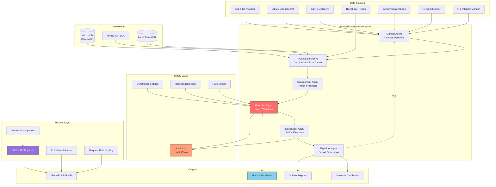

# SentinelForge

**Autonomous AI Cyber Defense Agent Framework**

SentinelForge is an open-source, multi-agent framework that autonomously detects, investigates, contains, and responds to cyber threats at machine speed — while being hardened against being hijacked or compromised itself.

Built for small-to-medium SOC teams, critical infrastructure operators, and security researchers who need AI-augmented defense without the risk of AI-introduced vulnerabilities.

> **Warning**: SentinelForge is alpha software. Always run in simulation mode first. Never deploy automated containment in production without thorough testing and human oversight. The authors are not responsible for unintended network disruptions.

---

## Quick Demo

```bash
pip install sentinelforge
sentinelforge demo
```

Open http://localhost:8501 to see the live dashboard with sample threat data.

---

## Architecture



### Agent Pipeline

| Agent | Role | MITRE Phase |
|-------|------|-------------|
| **Monitor** | Ingests logs, Windows events, network telemetry, file integrity checks | Discovery, Initial Access |
| **Investigator** | Correlates events, queries threat intel, root cause analysis | All phases |
| **Containment** | Proposes safe, reversible isolation actions | Containment |
| **Guardian** | Validates every action — veto power, injection detection | N/A (meta-agent) |
| **Responder** | Executes approved actions via connectors | Eradication, Recovery |
| **Explainer** | Generates human-readable reports with reasoning traces | Reporting |

---

## Threat Model

### What SentinelForge Defends Against

| Threat | Detection Method | MITRE ID |
|--------|-----------------|----------|
| SSH/RDP Brute Force | Log pattern matching, frequency analysis | T1110 |
| Port Scanning | Connection pattern analysis | T1046 |
| Privilege Escalation | sudo/setuid monitoring, Windows event 4672/4688 | T1548 |
| Data Exfiltration | Volume anomaly, DNS tunneling, bandwidth monitoring | T1048 |
| Malware/Reverse Shells | Process signature matching | T1059 |
| Lateral Movement | SMB/PsExec/WMI detection | T1021 |
| Credential Dumping | Known tool signatures (Mimikatz, etc.) | T1003 |
| Ransomware | File encryption patterns, ransom notes | T1486 |
| File Tampering | SHA-256 hash-based file integrity monitoring | T1565 |
| Suspicious Listeners | Listening port analysis (C2 ports) | T1571 |
| Account Manipulation | Windows event 4720/4726/4732/4738 | T1098 |
| Audit Log Clearing | Windows event 1102 | T1070 |

### What SentinelForge Defends Itself Against

| Self-Defense Threat | Mitigation |
|-------------------|------------|
| **Prompt Injection** | Regex pattern detection on all LLM inputs/outputs, input sanitization |
| **Goal Hijacking** | Constitutional rules enforced by Guardian agent |
| **Agent Runaway** | Rate limiting, iteration caps, repetition detection |
| **Audit Tampering** | Cryptographic SHA-256 hash chain on all log entries |
| **Action Escalation** | Allowlist-only actions, risk scoring, human-in-the-loop |
| **API Abuse** | JWT + API key auth, RBAC, per-IP rate limiting, request size limits |
| **Credential Theft** | Secrets loaded from .env (never in code), redacted in logs |
| **Supply Chain** | Local LLM priority (Ollama), no external API required |
| **Container Escape** | Least-privilege containers, read-only FS, no-new-privileges, cap_drop ALL |

### Security Architecture

```
Client Request
    │
    ▼
┌───────────────────────────────┐
│  Rate Limiter (per-IP)        │ ← 60 req/min default
├───────────────────────────────┤
│  Request Size Validator       │ ← 1MB max
├───────────────────────────────┤
│  Authentication               │
│  ├─ API Key (X-API-Key)       │
│  └─ JWT Bearer Token          │
├───────────────────────────────┤
│  Role-Based Access Control    │
│  ├─ viewer: read only         │
│  ├─ analyst: read + execute   │
│  └─ admin: full access        │
├───────────────────────────────┤
│  Input Sanitization           │ ← Prompt injection detection
├───────────────────────────────┤
│  Guardian Safety Validation   │ ← Constitutional rules
├───────────────────────────────┤
│  Audit Hash Chain             │ ← Tamper-evident logging
└───────────────────────────────┘
```

---

## Quick Start

### Prerequisites

- Python 3.11+
- Docker & Docker Compose (optional, for containerized deployment)
- Ollama (optional, for local LLM — the framework works without LLM in rule-based mode)

### Install from PyPI

```bash
pip install sentinelforge
```

To include all optional extras (dashboard, LLM providers, dev tools):

```bash
pip install "sentinelforge[all]"
```

### Alternative: Install from Source

```bash
git clone https://github.com/ctrl-sagesh/SentinelForge.git
cd SentinelForge
pip install -e ".[all]"
```

### Run a Simulation

```bash
# Run a brute force attack simulation (no LLM needed)
sentinelforge run --scenario brute_force

# Run ransomware simulation with LLM analysis
sentinelforge run --scenario ransomware --llm

# Run all evaluation scenarios
sentinelforge evaluate
```

### Start the API Server

```bash
sentinelforge serve
# API available at http://localhost:8000
# Swagger docs at http://localhost:8000/docs
```

### Launch the Dashboard

```bash
sentinelforge dashboard
# Dashboard at http://localhost:8501
```

### Docker Deployment

```bash
# Create .env with your secrets
cp .env.example .env
# Edit .env with your values

# Pull the Ollama model first (optional)
docker compose up ollama -d
docker exec sentinelforge-ollama ollama pull llama3.1:8b

# Start everything
docker compose up -d

# API: http://localhost:8000
# Dashboard: http://localhost:8501
```

---

## Authentication

### Enable Authentication

Set these environment variables or add to `.env`:

```bash
SF_AUTH__ENABLED=true
SF_JWT_SECRET=$(python -c "import secrets; print(secrets.token_hex(32))")
SF_DASHBOARD_PASSWORD=your_secure_password
```

### API Key Authentication

```bash
# Use API key in request header
curl -H "X-API-Key: sf_your_key_here" http://localhost:8000/api/v1/events
```

### JWT Authentication

```bash
# Login to get a token
curl -X POST http://localhost:8000/api/v1/auth/login \
  -H "Content-Type: application/json" \
  -d '{"username": "admin", "password": "your_password"}'

# Use token in subsequent requests
curl -H "Authorization: Bearer <token>" http://localhost:8000/api/v1/defend
```

### Roles

| Role | Permissions |
|------|------------|
| **viewer** | Read events, reports, audit, health |
| **analyst** | All viewer + submit events, run defense cycles, approve actions |
| **admin** | All analyst + manage settings, users, safety config |

---

## Real-World Monitoring

SentinelForge can monitor real systems (not just simulations):

### Windows Event Logs

```yaml
# In configs/default.yaml
monitor:
  enable_windows_events: true
  enable_sysmon: true        # Requires Sysmon installed
```

Monitors: Failed logins (4625), privilege escalation (4672/4688), account changes (4720/4726/4732), audit log clearing (1102), service installation (7045), and Sysmon events (process creation, network connections, registry changes).

### File Integrity Monitoring

```yaml
monitor:
  enable_file_integrity: true
  file_integrity_paths:
    - /etc
    - /usr/bin
    - C:\Windows\System32
```

Detects: file modifications, deletions, permission changes, and new files in monitored directories using SHA-256 hashes.

### Network Monitoring

```yaml
monitor:
  enable_network_monitor: true
  network_alert_threshold_mbps: 100.0
```

Detects: suspicious outbound connections (C2 ports), bandwidth anomalies (potential exfiltration), and suspicious listening ports. Uses psutil — no raw packet capture required.

---

## API Examples

### Submit an Event

```bash
curl -X POST http://localhost:8000/api/v1/events \
  -H "Content-Type: application/json" \
  -d '{
    "event_type": "brute_force",
    "description": "Multiple failed SSH logins from 203.0.113.42",
    "severity": "high",
    "source_ip": "203.0.113.42"
  }'
```

### Run a Defense Cycle

```bash
curl -X POST http://localhost:8000/api/v1/defend \
  -H "Content-Type: application/json" \
  -d '{
    "events": [{
      "event_type": "brute_force",
      "description": "Failed SSH login from 203.0.113.42",
      "severity": "high",
      "source_ip": "203.0.113.42"
    }],
    "use_llm": false
  }'
```

### Check System Health

```bash
curl http://localhost:8000/health
# Returns: CPU, memory, uptime, warnings
```

### Verify Audit Chain Integrity

```bash
curl http://localhost:8000/api/v1/audit/verify
```

---

## Configuration

SentinelForge is configured via YAML files in `configs/`. Environment variables override YAML values with the `SF_` prefix:

```bash
# Override LLM provider via environment
export SF_LLM__PROVIDER=anthropic
export SF_LLM__API_KEY=sk-ant-...
export SF_LLM__MODEL=claude-sonnet-4-6

# Enable auth
export SF_AUTH__ENABLED=true
export SF_JWT_SECRET=your_64_char_hex_secret

# Disable simulation mode
export SF_SIMULATION_MODE=false
```

See [`configs/default.yaml`](configs/default.yaml) for all options.

### Defense Policies

Edit `configs/default.yaml` to control:

- **Aggressiveness**: `passive` (alert only), `moderate` (auto-contain low risk), `aggressive` (auto-contain all)
- **Allowed Actions**: Whitelist of containment actions the system may take
- **Blocked Actions**: Permanently forbidden actions
- **Rate Limits**: Max automated actions per minute
- **Human Approval**: Required for high-risk or irreversible actions

### Environment Profiles

| Profile | Config File | Use Case |
|---------|------------|----------|
| Development | `configs/default.yaml` | Local testing, simulation mode |
| Production | `configs/production.yaml` | Real deployment, Elasticsearch SIEM |
| Home Lab | `configs/homelab.yaml` | Personal network monitoring |
| Critical Infra | `configs/critical.yaml` | Maximum safety, air-gapped |

---

## Project Structure

```
SentinelForge/
├── src/sentinelforge/
│   ├── agents/              # All 6 agent implementations
│   │   ├── base.py          # Base agent with safety hooks
│   │   ├── monitor.py       # Anomaly detection
│   │   ├── investigator.py  # Correlation & root cause
│   │   ├── containment.py   # Action proposals
│   │   ├── guardian.py      # Safety validation (critical)
│   │   ├── responder.py     # Action execution
│   │   └── explainer.py     # Report generation
│   ├── core/                # Framework infrastructure
│   │   ├── alerting.py      # Slack, email, syslog, webhook alerts
│   │   ├── audit.py         # Hash-chained audit log (dual-write)
│   │   ├── auth.py          # JWT + API key + RBAC
│   │   ├── config.py        # YAML + env configuration
│   │   ├── database.py      # SQLite persistence (WAL mode)
│   │   ├── guardrails.py    # Output validation + canary executor
│   │   ├── health.py        # Resource monitoring
│   │   ├── knowledge.py     # ChromaDB RAG wrapper
│   │   ├── llm.py           # LLM provider abstraction (retry, cost)
│   │   ├── logging.py       # Structured logging with rotation
│   │   ├── models.py        # Pydantic data models
│   │   ├── orchestrator.py  # LangGraph workflow
│   │   ├── safety.py        # Safety engine + constitutional rules
│   │   └── secrets.py       # Secrets management
│   ├── monitoring/          # Real-world data sources
│   │   ├── windows_events.py # Windows Event Log + Sysmon
│   │   ├── file_integrity.py # SHA-256 FIM
│   │   └── network.py       # psutil network monitoring
│   ├── connectors/          # External tool integrations
│   │   ├── siem.py          # Elasticsearch connector
│   │   └── threat_intel.py  # OTX, MISP, local DB
│   ├── knowledge/           # Vector DB for RAG
│   │   └── vector_store.py  # ChromaDB threat knowledge
│   ├── simulation/          # Cyber range
│   │   └── scenarios.py     # Attack simulations (MITRE-based)
│   ├── evaluation/          # Testing harness
│   │   └── harness.py       # Scenario evaluation
│   ├── dashboard/           # Streamlit UI
│   │   └── app.py
│   ├── api/                 # FastAPI server
│   │   └── server.py
│   └── cli.py               # CLI entry point
├── configs/                 # YAML configurations
│   ├── default.yaml
│   ├── production.yaml
│   ├── homelab.yaml
│   └── critical.yaml
├── data/                    # Sample data
│   ├── sample_logs.txt
│   └── threat_db.json
├── tests/                   # Test suite (166+ tests)
│   ├── test_agents.py       # Agent behavior tests
│   ├── test_alerting.py     # Alert dispatch tests
│   ├── test_api.py          # FastAPI endpoint tests
│   ├── test_audit.py        # Audit chain tests
│   ├── test_auth.py         # Auth & RBAC tests
│   ├── test_executors.py    # Executor & canary tests
│   ├── test_guardrails.py   # Output validation tests
│   ├── test_health.py       # Health monitor tests
│   ├── test_integration.py  # Full defense cycle tests
│   ├── test_llm.py          # LLM provider & retry tests
│   ├── test_monitoring.py   # Monitor agent tests
│   └── test_safety.py       # Safety engine tests
├── scripts/
│   ├── setup_linux.sh       # Linux/macOS setup
│   └── setup_windows.ps1    # Windows setup
├── .github/workflows/
│   ├── ci.yml               # Lint, test, security scan
│   └── release.yml          # Docker build, GitHub release
├── docker/
│   └── Dockerfile           # Multi-stage, non-root
├── docker-compose.yml       # API + worker + dashboard + Ollama
├── Makefile                 # Common commands
├── .env.example
└── pyproject.toml
```

---

## Security Considerations

### What This Framework IS

- A research and operational tool for **authorized** security teams
- A force multiplier for SOC analysts, not a replacement
- A simulation platform for testing detection capabilities
- An educational tool for understanding AI-in-the-loop defense

### What This Framework IS NOT

- A fully autonomous, unsupervised defense system (human oversight is mandatory)
- A replacement for proper network segmentation, patching, and security hygiene
- An offensive security tool (it contains no exploit code)
- Production-ready without extensive testing in your specific environment

### Responsible Deployment Checklist

1. **Always** start in simulation mode (`simulation_mode: true`)
2. **Always** keep human approval enabled for production
3. **Always** enable API authentication before exposing the API
4. **Never** run with `blocked_actions: []` — keep the deny list populated
5. **Never** commit `.env` or secrets to version control
6. **Review** audit logs regularly for anomalous agent behavior
7. **Test** against your own infrastructure in a lab before production
8. **Limit** the service account permissions to the absolute minimum
9. **Monitor** LLM outputs for prompt injection, especially with external threat feeds
10. **Air-gap** if possible — prefer local LLMs over cloud APIs for sensitive environments

### Known Limitations

- Signature-based detection can be evaded by novel attack patterns
- LLM-based analysis depends on model quality and can hallucinate
- The prompt injection detection uses regex patterns — sophisticated injections may bypass it
- Network containment actions (block_ip, isolate_host) require actual firewall/EDR integration
- The audit hash chain protects against tampering but not against a compromised logger process
- Windows Event Log monitoring requires pywin32 (Windows only)
- File integrity monitoring has a cold-start problem (first baseline must be established on clean system)
- Network monitoring uses psutil (no deep packet inspection)

---

## Running Tests

```bash
pip install -e ".[dev]"
pytest tests/ -v
```

Current: **166+ tests**, all passing. Covers: agents, alerting, API endpoints, audit chain, authentication, executors, guardrails, health monitoring, integration (full defense cycle), LLM provider/retry, monitoring, and safety engine.

---

## Roadmap

### v0.5 — Enhanced Detection
- [ ] Integrate Zeek/Suricata log parsers
- [ ] OSQuery live endpoint querying
- [ ] ML-based anomaly detection (isolation forest, autoencoders)
- [ ] YARA rule support

### v0.6 — Enterprise Hardening
- [ ] Mutual TLS between agents
- [ ] HashiCorp Vault integration
- [ ] Prometheus metrics + Grafana dashboards
- [ ] Automated audit log backup and rotation

### v0.7 — Advanced Intelligence
- [ ] Federated learning across deployments (privacy-preserving)
- [ ] Multi-agent swarm coordination
- [ ] Automated playbook generation
- [ ] STIX/TAXII threat intel integration

### v0.8 — Enterprise Features
- [ ] Multi-tenant support
- [ ] Cloud-native deployment (Kubernetes Helm charts)
- [ ] SOAR integration (Cortex XSOAR, Splunk SOAR)
- [ ] Compliance report generation (SOC2, ISO 27001)

---

## Contributing

See [CONTRIBUTING.md](CONTRIBUTING.md) for guidelines.

---

## License

MIT License. See [LICENSE](LICENSE) for details.

---

## Acknowledgments

- [MITRE ATT&CK](https://attack.mitre.org/) for the threat framework
- [LangGraph](https://github.com/langchain-ai/langgraph) for agent orchestration
- [Ollama](https://ollama.com/) for local LLM inference
- The open-source security community

---

*Built with the philosophy that AI defense tools must be safer than the threats they fight.*
